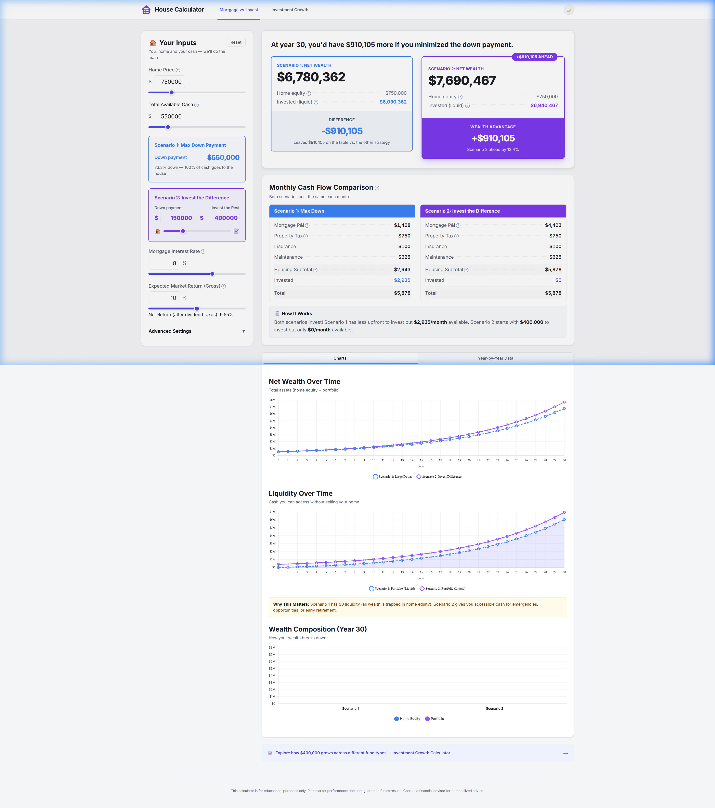
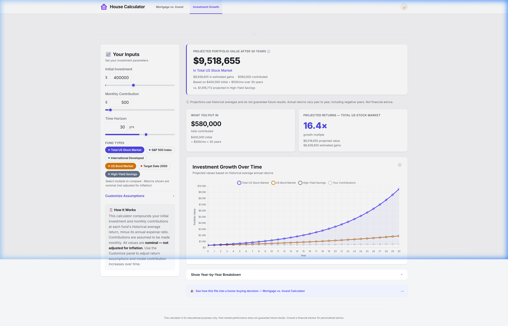

<p align="center">
  
</p>

<h1 align="center">House Calculator</h1>

<p align="center">
  <strong>Make data-driven decisions about your home and your money.</strong><br>
  Compare mortgage down-payment strategies and project long-term investment growth — all in one tool.
</p>

<p align="center">
  <a href="#features">Features</a> •
  <a href="#demo">Demo</a> •
  <a href="#getting-started">Getting Started</a> •
  <a href="#how-it-works">How It Works</a> •
  <a href="#tech-stack">Tech Stack</a> •
  <a href="#license">License</a>
</p>

---

## Two Calculators, One App

House Calculator is a suite of two interconnected financial tools — a **Mortgage vs. Invest Calculator** and an **Investment Growth Calculator** — linked together so you can explore the full picture of your financial decisions.

---

## Demo

### Mortgage vs. Invest

> *"Should I put a massive down payment on my house, or put down less and invest the rest?"*



### Investment Growth

> *"How will my portfolio grow over time across different fund types?"*



---

## Features

### 🏠 Mortgage vs. Invest Calculator

Compare two strategies side-by-side over a configurable loan term:

| | Scenario 1: Max Down Payment | Scenario 2: Invest the Difference |
|---|---|---|
| **Strategy** | Put all available cash toward the down payment | Put down less and invest the rest |
| **Monthly cost** | Lower mortgage payment | Higher mortgage payment |
| **Investment** | Invests the monthly housing savings | Starts with a large lump sum |

**What you get:**
- **Dynamic headline** — instantly tells you how much more wealth one strategy produces
- **Winner badge & wealth advantage** — the winning scenario gets highlighted with a glow, badge, and the exact dollar advantage
- **Net Wealth comparison chart** — line chart tracking total assets (home equity + portfolio) year-by-year
- **Liquidity comparison chart** — shows how much *accessible* cash you have (portfolio vs. trapped home equity)
- **Wealth Composition bar chart** — stacked bar showing the equity/portfolio breakdown at the final year
- **Monthly Cash Flow cards** — side-by-side breakdown of mortgage P&I, property tax, insurance, maintenance, and investment contribution
- **"How It Works" explainer** — dynamically updates to explain the specific trade-off with your numbers
- **30-Year Data Table** — full year-by-year amortization with loan balance, portfolio value, net wealth, and S2 advantage
- **Tax drag modeling** — reduces gross returns by `dividend yield × tax rate` for realistic after-tax projections

**Advanced Settings** (collapsible):
- Loan term (5–30 years)
- Property tax rate, annual insurance, annual maintenance
- Dividend yield and dividend tax rate
- Full tax drag calculation with live readout

---

### 📈 Investment Growth Calculator

A full-featured standalone investment projector with multi-fund comparison.

**Core Inputs:**
- **Initial Investment** — lump sum ($0–$1M)
- **Monthly Contribution** — recurring investment ($0–$10K/mo)
- **Time Horizon** — 1 to 50 years

**Fund Types** — toggle any combination on/off to compare:

| Fund | Benchmark | Hist. Return | Expense Ratio |
|---|---|---|---|
| **Total US Stock Market** | VTSAX / VTI | 10.2% | 0.03% |
| **S&P 500 Index** | VOO / FXAIX | 10.0% | 0.03% |
| **International Developed** | VXUS / FZILX | 5.8% | 0.06% |
| **US Bond Market** | BND / VBTLX | 4.5% | 0.03% |
| **Target Date 2050** | VFIFX | 8.2% | 0.12% |
| **High-Yield Savings** | Marcus, SoFi | 4.5% | N/A |

**Output Dashboard:**
- **Projected Portfolio Value banner** — headline number with fund name, estimated gains, and total contributions
- **HYSA comparison** — automatically shows what you'd earn in a savings account vs. your selected fund
- **"What You Put In" card** — total contributions broken down into initial + monthly × years
- **"Projected Returns" card** — growth multiple (e.g. "15.5×") with projected value and estimated gains
- **Investment Growth Over Time chart** — multi-line chart comparing all selected funds with a contribution baseline
- **Year-by-Year Breakdown table** — expandable table with per-fund projected values at each year

**Customize Assumptions** (collapsible):
- **Annual Contribution Increase** — model salary-growth escalation (e.g. 3%/year makes $500/mo become $515, $530, etc.)
- **Per-fund return overrides** — adjust the annual return for any fund
- **Per-fund expense ratio overrides** — test the impact of higher/lower fees
- **Fee Impact card** — shows how much fees cost you over the full horizon
- **Reset to Defaults** button

---

### 🔗 Cross-Linked Navigation

The two calculators are connected:
- From Mortgage → *"Explore how $400,000 grows across different fund types → Investment Growth Calculator"*
- From Investment → *"See how this fits into a home-buying decision → Mortgage vs. Invest Calculator"*

The investment amount carries over from your Scenario 2 "Invest the Rest" allocation, so the tools work together seamlessly.

---

### 🎨 Design & UX
- **Dark / Light mode** — persisted to localStorage, respects system preference
- **Responsive layout** — full desktop grid collapses to stacked mobile layout
- **Tooltips** on every financial term (`?` icons) for education
- **Animated value transitions** — numbers smoothly count up/down on changes (respects `prefers-reduced-motion`)
- **Premium typography** — Inter with fluid `clamp()` design tokens
- **Smooth section transitions** — fade in/out when switching between calculators
- **No "Calculate" button** — everything updates live as you drag sliders or type

---

## Getting Started

House Calculator is a **zero-dependency, static HTML application**. No build step. No server. No npm install.

### Run Locally

1. **Clone the repository:**
   ```bash
   git clone https://github.com/mkov1988/house-calculator.git
   cd house-calculator
   ```

2. **Open `index.html` in your browser:**
   - Double-click `index.html`, or
   - Use a local server:
     ```bash
     # Python
     python -m http.server 8000

     # Node.js
     npx serve .
     ```

3. **That's it.** No dependencies to install.

### Deploy

Since the app is a single HTML file with no build process, you can deploy it anywhere that serves static files:

- **GitHub Pages** — push to `main` and enable Pages in repo settings
- **Netlify / Vercel** — drag-and-drop the project folder
- **Any web server** — just serve `index.html`

---

## How It Works

### Mortgage Calculator Math

**Monthly Payment (P&I):**
```
M = P × [ r(1+r)^n ] / [ (1+r)^n − 1 ]
```

**Remaining Loan Balance** after `k` payments:
```
B(k) = P × [ (1+r)^n − (1+r)^k ] / [ (1+r)^n − 1 ]
```

**Tax Drag** (applied to investment returns):
```
Tax Drag = Dividend Yield × Dividend Tax Rate
Net Return = Gross Return − Tax Drag
```

**Key Insight:** Both scenarios spend the same total amount each month. The lower-mortgage scenario invests the difference. The higher-mortgage scenario starts with a bigger lump sum but contributes $0/month. The tool visualizes this trade-off over time.

### Investment Calculator Math

**Standard Compound Growth** (monthly compounding):
```
FV = P × (1 + r)^n + C × [ (1 + r)^n − 1 ] / r
```
Where `P` = initial investment, `r` = monthly net return, `n` = total months, `C` = monthly contribution.

**Escalating Contributions** (when annual increase > 0%):
Each year's monthly contribution = `C × (1 + g)^(year-1)`, compounded month-by-month.

**Net Return per Fund:**
```
Net Return = Gross Historical Return − Expense Ratio
```

---

## Configurable Inputs

### Mortgage vs. Invest

| Input | Default | Range |
|---|---|---|
| Home Price | $750,000 | $100K – $3M |
| Total Available Cash | $550,000 | $0 – $3M |
| S2 Down Payment | $150,000 | $0 – Total Cash |
| Mortgage Rate | 8.0% | 0% – 12% |
| Expected Market Return | 10.0% | 0% – 20% |
| Loan Term | 30 years | 5 – 30 |
| Property Tax Rate | 1.2% | 0% – 4% |
| Annual Insurance | $1,200 | $0 – $25K |
| Annual Maintenance | 1.0% | 0% – 5% |
| Dividend Yield | 1.8% | 0% – 5% |
| Dividend Tax Rate | 25% | 0% – 50% |

### Investment Growth

| Input | Default | Range |
|---|---|---|
| Initial Investment | $10,000 | $0 – $1M |
| Monthly Contribution | $500 | $0 – $10K |
| Time Horizon | 25 years | 1 – 50 |
| Fund Types | Total Stock, Bonds, HYSA | 6 available |
| Annual Contribution Increase | 0% | 0% – 15% |
| Per-fund Return Override | (varies by fund) | 0% – 20% |
| Per-fund Expense Ratio Override | (varies by fund) | 0% – 3% |

---

## Tech Stack

| Layer | Technology |
|---|---|
| **Structure** | HTML5, semantic markup |
| **Styling** | Vanilla CSS with custom properties (design tokens), fluid typography via `clamp()` |
| **Logic** | Vanilla JavaScript (ES6+) |
| **Charts** | [Chart.js](https://www.chartjs.org/) v4.4.7 (CDN) |
| **Typography** | [Inter](https://fonts.google.com/specimen/Inter) via Google Fonts |
| **Build** | None — zero build step, single-file architecture |

---

## Project Structure

```
house-calculator/
├── index.html            # The entire application (HTML + CSS + JS)
├── house calc logo.svg   # App logo (purple house icon)
├── screenshot.png        # Mortgage calculator screenshot
├── screenshot-invest.png # Investment calculator screenshot
├── PRD.md                # Product Requirements Document
├── CLAUDE.md             # AI assistant context file
└── README.md             # You are here
```

---

## Disclaimer

This calculator is for **educational purposes only**. Past market performance does not guarantee future results. Consult a financial advisor for personalized advice.

---

## License

MIT © 2026
